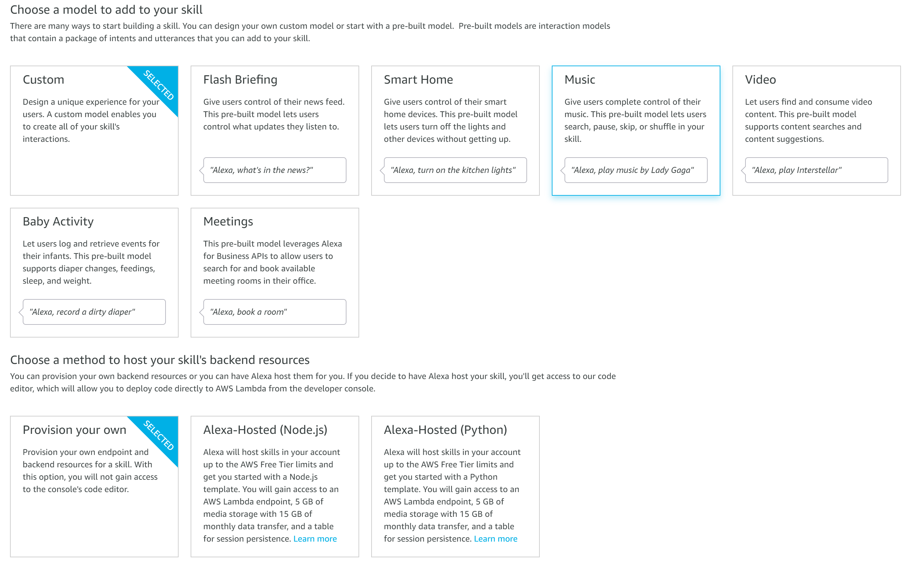

# Connect a bot to Alexa

You can configure your bot to communicate with people using Alexa devices that support Custom Skills.

**Important**: Your bot must use the [Bot Framework Sdk](https://github.com/microsoft/botframework-sdk) version 4.8 or later. If you create a new bot via the Azure Portal it will have 4.8 or later. If you have an existing bot you may need to update your Sdk version.


## Create an Alexa skill

1. Log into the [Alexa Developer Console](https://developer.amazon.com/alexa/console/ask) and then click the 'Create Skill' button.

2. On the next screen enter a name for your new skill.  On this page you can **Choose a model to add to your skill** (**Custom** selected by default) and **Choose a method to host your skill's backend resources** (**Provision your own** selected by default).  Leave the default options selected and click the **Create Skill** button.



3. On the next screen you will be asked to **Choose a template**.  **Start from scratch** will be selected by default. Leave **Start from scratch** selected and click the **Choose** button.


4. You will now be presented with your skill dashboard. Navigate to **JSON Editor** within the **Interaction Model** section of the left hand menu.

5. Paste the JSON below into the **JSON Editor**, replacing the following values;

* **YOUR SKILL INVOCATION NAME** - This is the name that users will use to invoke your skill on Alexa. For example, if your skill invocation name was 'adapter helper', then a user would could say "Alexa, launch adapter helper" to launch the skill.

* **EXAMPLE PHRASES** - You should provide 3 example phases that users could use to interact with your skill.  For example, if a user might say "Alexa, ask adapter helper to give me details of the alexa adapter", your example phrase would be "give me details of the alexa adapter".

```json
{
    "interactionModel": {
        "languageModel": {
            "invocationName": "<YOUR SKILL INVOCATION NAME>",
            "intents": [
                {
                    "name": "GetUserIntent",
                    "slots": [
                        {
                            "name": "phrase",
                            "type": "phrase"
                        }
                    ],
                    "samples": [
                        "{phrase}"
                    ]
                },
                {
                    "name": "AMAZON.StopIntent",
                    "samples": []
                }
            ],
            "types": [
                {
                    "name": "phrase",
                    "values": [
                        {
                            "name": {
                                "value": "<EXAMPLE PHRASE>"
                            }
                        },
                        {
                            "name": {
                                "value": "<EXAMPLE PHRASE>"
                            }
                        },
                        {
                            "name": {
                                "value": "<EXAMPLE PHRASE>"
                            }
                        }
                    ]
                }
            ]
        }
    }
}
```

6. Click the **Save Model** button and then click **Build Model**, which will update the configuration for your skill.

7. Get your **Alexa Skill Id** either from the Url in the Alexa Portal or by going to the [Alexa Developer Console](https://developer.amazon.com/alexa/console/ask) and clicking **View Skill ID**. Your Alexa Skill Id should be a value like 'amzn1.ask.skill.A GUID'.

8. In the Bot Framework Portal navigate to the Alexa Channel Configuration page and paste your **Alexa Skill Id** into the **Enter skill Id** field.

9. In the Alexa Portal navigate to the **Endpoint** section on the left hand menu.  Select **HTTPS** as the **Service Endpoint Type** and set the **Default Region** endpoint to the **Alexa Service Endpoint URI** value copied from the Bot Framework Alexa Configuration page.

10. In the drop down underneath the text box where you have defined your endpoint, you need to select the type of certificate being used. Choose **My development endpoint has a certificate from a trusted certificate authority**.


11. Click the **Save Endpoints** button in the Alexa Portal.

12. Click the **Save** button in the Bot Framework Alexa Channel Configuration page.

You will need to publish your Skill within Alexa before users other than yourself can communicate with it. You can test your skill, prior to publishing it, within Alexa using an Alexa device you own or from the **Test** tab for your skill. To get to the **Test** tab navigate to your Skill from the [Alexa Developer Console](https://developer.amazon.com/alexa/console/ask).
