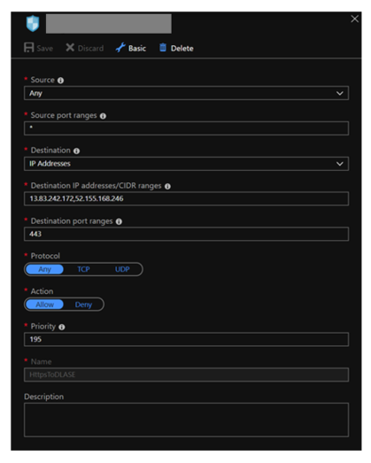

# Use direct line app service extension within a VNET

This article describes how to use the Direct Line App Service Extension with an Azure Virtual Network (VNET).

## Create an App Service Environment and other Azure resources

1. Direct line app service extension is available on all **Azure App Services**, including those hosted within an **Azure App Service Environment**. An Azure App Service Environment provides isolation and is ideal for working within a VNET.
    - Instructions for creating an external App Service Environment can be found in [Create an External App Service environment](https://docs.microsoft.com/azure/app-service/environment/create-external-ase) article.
    - Instructions for creating an internal App Service Environment can be found in [Create and use an Internal Load Balancer App Service Environment](https://docs.microsoft.com/azure/app-service/environment/create-ilb-ase) article.
1. Once you have created your App Service Environment, you need to add an App Service Plan inside of it where you can deploy your bots (and thus run Direct Line App Service Extension). To do this:
    - Go to https://portal.azure.com/
    - Create a new “App Service Plan” resource.
    - Under Region, select your App Service Environment
    - Finish creating your App Service Plan

## Configure the VNET Network Security Groups (NSG)

1. Direct Line App Service Extension requires an outbound connection so that it can issue HTTP requests. This can be configured as an outbound rule in your VNET NSG that is associated with the App Service Environment’s subnet. The rule that required is as follows:

|Source|Any|
|---|---|
|Source Port|*|
|Destination|IP Addresses|
|Destination IP addresses|20.38.80.64, 40.82.248.64|
|Destination port ranges|443|
|Protocol|Any|
|Action|Allow|

>[!NOTE]
> The IP addresses provided are explicitly for the preview. We will be moving to a Service Tag for Azure Bot Service later in the year which will change this configuration.

### Configure your bot’s App Service

For the preview, you will need to change how your Direct line app service extension communicates with Azure. This can be done by adding a new **App Service Application Setting** to your application using the portal, or the `applicationsettings.json` file:

- Property: DirectLineExtensionABSEndpoint
- Value: https://st-directline.botframework.com/v3/extension

>[!NOTE]
> This will only be required for the preview of Direct line app service extension.
