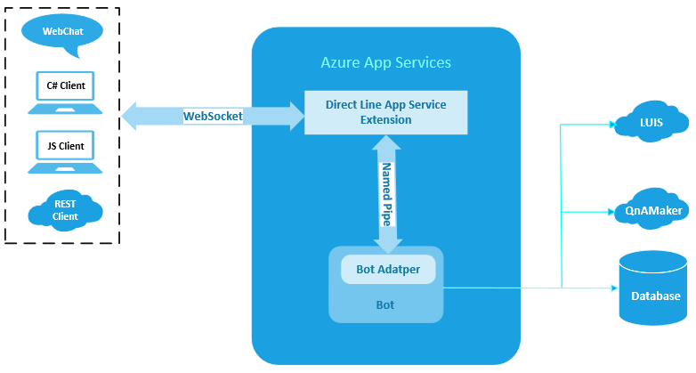

# Direct Line App Service Extension

[!INCLUDE[applies-to-v4](includes/applies-to.md)]

The direct line app service extension allows clients to connect directly with the host, where the bot is located. This provides workload isolation and, in some cases, improved performance. The following picture shows the overall architecture:

The direct line app service extension adds a new set of streaming extensions to the Bot Framework protocol, which replace HTTP for exchanging messages with a transport that allows bidirectional requests to be sent over a **persistent WebSocket**.

Before streaming extensions, the Direct Line API offered one way for a client to send Activities to Direct Line and two ways for a client to retrieve Activities from Direct Line. The messages were sent via an HTTP POST, and received by either an HTTP GET (polling) or by opening a WebSocket to receive ActivitySets.
Streaming extensions expand on the use of the WebSocket an allows **all messaging communication** to be sent on that WebSocket. Streaming extensions can also be used between channel services and the bot.

The direct line app service extension is pre-installed on all instances of Azure App Services in every data center around the world. It is maintained and managed by Microsoft without additional deployment work for the customer. It is disabled on Azure App Services by default, but it can be easily turned on so that it can connect to your hosted bot.

## See Also

|Name|Description|
|---|---|
|[Configure .NET bot for extension](bot-service-channel-directline-extension-net-bot.md)|Update a bot to work with **named pipes**, and enable the direct line app service extension in the **Azure App Service** resource where the bot is hosted.  |
|[Create .NET client with Extension](bot-service-channel-directline-extension-net-client.md)|Create a .NET client in C# which connects to the direct line app service extension|
|[Use extension with WebChat](bot-service-channel-directline-extension-webchat-client.md)|Use WebChat with the direct line app service extension|
|[Use extension within VNET](bot-service-channel-directline-extension-vnet.md)|Use the direct line app service extension with an Azure Virtual Network (VNET)|

## Addtional resources

- [Connect a bot to Direct Line](bot-service-channel-connect-directline.md)
- [Connect a bot to Direct Line Speech](bot-service-channel-connect-directlinespeech.md)
