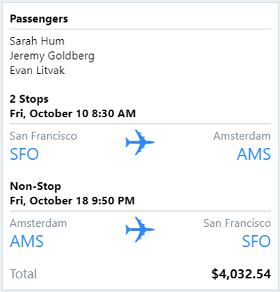
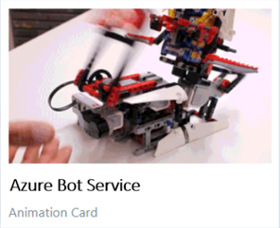
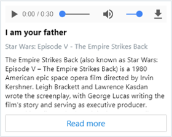
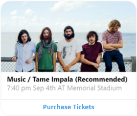
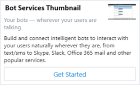
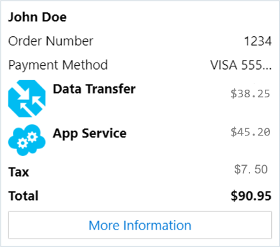
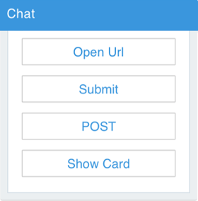
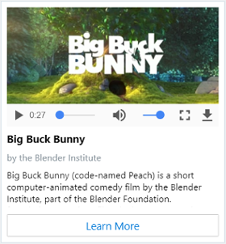
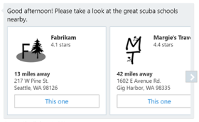

# Design the user experience

You can create bots with a variety of features such as text, buttons, images, rich cards displayed in carousel or list format, and more. However, each channel such as Facebook, Slack, Skype, etc. ultimately controls how its messaging clients render features. Even when multiple channels support a feature, each channel may render the feature in a slightly different way. In cases where a message contains feature(s) that a channel does not natively support, the channel may attempt to down-render message contents as text or as a static image, which can significantly impact the message's appearance on the client. In some cases, a channel may not support a particular feature at all. For example, GroupMe clients cannot display a typing indicator.

## Rich user controls

**Rich user controls** are common UI controls such as buttons, images, carousels, and menus that the bot presents to the user and the user engages with to communicate choice and intent. A bot can use a collection of UI controls to mimic an app, or can even run embedded within an app. When a bot is embedded within an app or website, it can represent virtually any UI control by leveraging the capabilities of the app that is hosting it. 

For decades, application and website developers have relied on UI controls to enable users to interact with their applications and these same UI controls can also be very effective in bots. For instance, buttons are a great way to present the user with a simple choice. Allowing the user to communicate "Hotels" by clicking a button labeled **Hotels** is easier and quicker than forcing the user to type "Hotels." This especially holds true on mobile devices, where clicking is greatly preferred over typing.

## Cards

Cards allow you to present your users with a variety of visual, audio, and/or selectable messages and help to assist conversation flow. If a user needs to select from within a fixed set of items you can display a carousel of cards, each containing an image, a text description, and a single selection button. If a user has a set of choices for a single item, you can present a smaller single image and a collection of buttons with various options to choose between. Did they ask for more information on a subject? Cards can provide in depth information using audio or video output, or a receipt that details their shopping experience. There is an incredibly wide range uses for cards to help guide the conversation between your user and your bot. The type of card you use will be determined by the needs of your application. Let’s take a closer look at cards, their actions, and some recommended uses. 

Microsoft Bot Service cards are programmable objects containing standardized collections of rich user controls that are recognized across a wide range of channels. The following table describes the list of available cards and best practice suggestions of usage for each type of card.

| Card type | Example | Description |
| ---- | ---- | ---- |
| AdaptiveCard |  | An open card exchange format rendered as a JSON object. Typically used for cross-channel deployment of cards. Cards adapt to the look and feel of each host channel. |
| AnimationCard |  | A card that can play animated GIFs or short videos. |
| AudioCard |  | A card that can play an audio file. |
| HeroCard |  | A card that contains a single large image, one or more buttons, and text. Typically used to visually highlight a potential user selection. |
| ThumbnailCard |  | A card that contains a single thumbnail image, one or more buttons, and text. Typically used to visually highlight the buttons for a potential user selection. |
| ReceiptCard |  | A card that enables a bot to provide a receipt to the user. It typically contains the list of items to include on the receipt, tax and total information, and other text. |
| SignInCard |  | A card that enables a bot to request that a user sign-in. It typically contains text and one or more buttons that the user can click to initiate the sign-in process. |
| SuggestedAction |  | Presents your user with a set of CardActions representing a user choice. This card disappears once any of the suggested actions is selected. |
| VideoCard |  | A card that can play videos. Typically used to open a URL and stream an available video. |
| CardCarousel |  | A horizontally scrollable collection of cards that allows your user to easily view a series of possible user choices.|

Cards allow you to design your bot once, and have it work across a variety of channels. However, not all card types are fully supported across all available channels. 

Detailed instructions for adding cards to your bot can be found within these sections [Add rich card media attachments](v4sdk/bot-builder-howto-add-media-attachments.md) and [Add suggested actions to messages](v4sdk/bot-builder-howto-add-suggested-actions.md). Sample code can also be found here for cards: [C#](https://aka.ms/bot-cards-sample-code-cs)/[JS](https://aka.ms/bot-cards-sample-code-js) adaptive cards: [C#](https://aka.ms/bot-adaptive-cards-sample-code)/[JS](https://aka.ms/bot-adaptive-cards-js-sample-code), attachments: [C#](https://aka.ms/bot-attachments-sample-code)/[JS](https://aka.ms/bot-attachments-js-sample-code), and suggested actions: [C#](https://aka.ms/bot-suggested-actions-code)/[JS](https://aka.ms/bot-suggested-actions-js-code).

When designing your bot, do not automatically dismiss common UI elements as not being "smart enough." As discussed [previously](~/bot-service-design-principles.md#designing-a-bot), your bot should be designed to solve the user's problem in the best, quickest, and easiest manner possible. Avoid the temptation to start by incorporating natural language understanding, as it is often unnecessary and introduces unjustified complexity.

> [!TIP]
> Start by using the minimum UI controls that enable the bot to solve the user's problem,
> and add other elements later if those controls are no longer sufficient.

## Text and natural language understanding

A bot can accept **text** input from users and attempt to parse that input using regular expression matching or **natural language understanding** APIs, such as <a href="https://www.luis.ai" target="_blank">LUIS</a>. Depending on the type of input that the user provides, natural language understanding may or may not be a good solution.

In some cases, a user may be **answering a very specific question**. For example, if the bot asks, "What is your name?", the user may answer with text that specifies only the name, "John", or with a sentence, "My name is John".

Asking specific questions reduces the scope of potential responses that the bot might reasonably receive, which decreases the complexity of the logic necessary to parse and understand the response. For example, consider the following broad, open-ended question: "How are you feeling?". Understanding the many possible permutations of potential answers to such a question is a very complex task.

In contrast, specific questions such as "Are you feeling pain? yes/no" and "Where are you feeling pain? chest/head/arm/leg" would likely prompt more specific answers that a bot can parse and understand without needing to implement natural language understanding. 

> [!TIP]
> Whenever possible, ask specific questions that will not require natural language understanding capabilities to parse the response. This will simplify your bot and increase the success your bot will understand the user.

  
In other cases, a user may be **typing a specific command**. For example, a DevOps bot that enables developers to manage virtual machines could be designed to accept specific commands such as "/STOP VM XYZ" or "/START VM XYZ". Designing a bot to accept specific commands like this makes for a good user experience, as the syntax is easy to learn and the expected outcome of each command is clear. Additionally, the bot will not require natural language understanding capabilities, since the user's input can be easily parsed using regular expressions. 

> [!TIP]
> Designing a bot to require specific commands from the user can often provide a good user experience while 
> also eliminating the need for natural language understanding capability.

  
In the case of a *knowledge base* bot or *questions and answers* bot, a user may be **asking general questions**. For example, imagine a bot that can answer questions based on the contents of thousands of documents. <a href="https://qnamaker.ai" target="_blank">QnA Maker</a> and <a href="https://azure.microsoft.com/services/search/" target="_blank">Azure Search</a> are both technologies which are designed specifically for this type of scenario. For more information, see [Design knowledge bots](bot-service-design-pattern-knowledge-base.md).

> [!TIP]
> If you are designing a bot that will answer questions based on structured or unstructured data from 
> databases, web pages, or documents, consider using technologies that are designed specifically to address this 
> scenario rather than attempting to solve the problem with natural language understanding.

  
In other scenarios, a user may be **typing simple requests based on natural language**. For example, a user may type "I want a pepperoni pizza" or "Are there any vegetarian restaurants within 3 miles from my house open now?". Natural language understanding APIs such as [LUIS.ai](https://www.luis.ai) are a great fit for scenarios like this. 

Using the APIs, your bot can extract the key components of the user's text to identify the user's intent. When implementing natural language understanding capabilities in your bot, set realistic expectations for the level of detail that users are likely to provide in their input. 

> [!TIP]
> When building natural language models, do not assume that users will provide all the required information in their initial query. 
> Design your bot to specifically request the information it requires, guiding the user to provide that information 
> by asking a series of questions, if necessary. 

  
## Speech

A bot can use **speech** input and/or output to communicate with users. In cases where a bot is designed to support devices that have no keyboard or monitor, speech is the only means of communicating with the user. 

## Choosing between rich user controls, text and natural language, and speech

Just like people communicate with each other using a combination of gestures, voice, and symbols, bots can communicate with users using a combination of rich user controls, text (sometimes including natural language), and speech. These communication methods can be used together; you do not need to choose one over another. 

For example, imagine a "cooking bot" that helps users with recipes, where the bot may provide instructions by playing a video or displaying a series of pictures to explain what needs to be done. Some users may prefer to flip pages of the recipe or ask the bot questions using speech while they are assembling a recipe. Others may prefer to touch the screen of a device instead of interacting with the bot via speech. When designing your bot, incorporate the UX elements that support the ways in which users will likely prefer to interact with your bot, given the specific use cases that it is intended support. 

