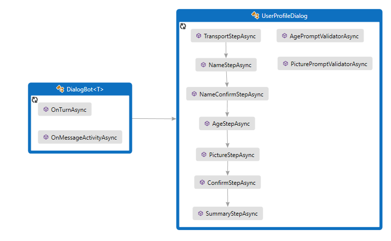
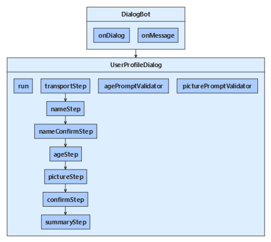
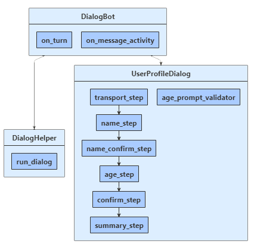

# Implement sequential conversation flow

[!INCLUDE[applies-to](../includes/applies-to.md)]

Gathering information by posing questions is one of the main ways a bot interacts with users. The dialogs library provides useful built-in features such as *prompt* classes that make it easy to ask questions and validate the response to make sure it matches a specific data type or meets custom validation rules.

You can manage simple and complex conversation flows using the dialogs library. In a simple interaction, the bot runs through a fixed sequence of steps, and the conversation finishes. In general, a dialog is useful when the bot needs to gather information from the user. This topic details how to implement simple conversation flow by creating prompts and calling them from a waterfall dialog.

> [!TIP]
> For examples of how to write your own prompts without using the dialogs library, see the [Create your own prompts to gather user input](bot-builder-primitive-prompts.md) article.

## Prerequisites

- Knowledge of [bot basics][concept-basics], [managing state][concept-state], and the [dialogs library][concept-dialogs].
- A copy of the **multi-turn prompt** sample in either [**C#**][cs-sample], [**JavaScript**][js-sample], or [**Python**][python-sample].

## About this sample

In the multi-turn prompt sample, we use a waterfall dialog, a few prompts, and a component dialog to create a simple interaction that asks the user a series of questions. The code uses a dialog to cycle through these steps:

| Steps        | Prompt type  |
|:-------------|:-------------|
| Ask the user for their mode of transportation | Choice prompt |
| Ask the user for their name | Text prompt |
| Ask the user if they want to provide their age | Confirm prompt |
| If they answered yes, asks for their age | Number prompt with validation to only accept ages greater than 0 and less than 150 |
| If they're not using Microsoft Teams, them for a profile picture | Attachment prompt with validation to allow a missing attachment |
| Asks if the collected information is "ok" | Reuse Confirm prompt |

Finally, if they answered yes, display the collected information; otherwise, tell the user that their information will not be kept.

## Create the main dialog

# [C#](#tab/csharp)

To use dialogs, install the **Microsoft.Bot.Builder.Dialogs** NuGet package.

The bot interacts with the user via `UserProfileDialog`. When we create the bot's `DialogBot` class, we will set the `UserProfileDialog` as its main dialog. The bot then uses a `Run` helper method to access the dialog.

**Dialogs\UserProfileDialog.cs**

We begin by creating the `UserProfileDialog` that derives from the `ComponentDialog` class, and has 7 steps.

In the `UserProfileDialog` constructor, create the waterfall steps, prompts and the waterfall dialog, and add them to the dialog set. The prompts need to be in the same dialog set in which they are used.

[!code-csharp[Constructor snippet](~/../botbuilder-samples/samples/csharp_dotnetcore/05.multi-turn-prompt/Dialogs/UserProfileDialog.cs?range=21-48)]

Next, we implement the steps that the dialog uses. To use a prompt, call it from a step in your dialog and retrieve the prompt result in the following step using `stepContext.Result`. Behind the scenes, prompts are a two-step dialog. First, the prompt asks for input; second, it returns the valid value, or starts over from the beginning with a reprompt until it receives a valid input.

You should always return a non-null `DialogTurnResult` from a waterfall step. If you do not, your dialog may not work as designed. Here we show the implementation for the `NameStepAsync` in the waterfall dialog.

[!code-csharp[Name step](~/../botbuilder-samples/samples/csharp_dotnetcore/05.multi-turn-prompt/Dialogs/UserProfileDialog.cs?range=62-67)]

In `AgeStepAsync`, we specify a retry prompt for when the user's input fails to validate, either because it is in a format that the prompt can not parse, or the input fails a validation criteria. In this case, if no retry prompt was provided, the prompt will use the initial prompt text to re-prompt the user for input.

[!code-csharp[Age step](~/../botbuilder-samples/samples/csharp_dotnetcore/05.multi-turn-prompt/Dialogs/UserProfileDialog.cs?range=80-99&highlight=10)]

**UserProfile.cs**

The user's mode of transportation, name, and age are saved in an instance of the `UserProfile` class.

[!code-csharp[UserProfile class](~/../botbuilder-samples/samples/csharp_dotnetcore/05.multi-turn-prompt/UserProfile.cs?range=11-20)]

**Dialogs\UserProfileDialog.cs**

In the last step, we check the `stepContext.Result` returned by the dialog called in the previous waterfall step. If the return value is true, we use the user profile accessor to get and update the user profile. To get the user profile, we call the `GetAsync` method, and then set the values of the `userProfile.Transport`, `userProfile.Name`, `userProfile.Age` and `userProfile.Picture` properties. Finally, we summarize the information for the user before calling `EndDialogAsync` which ends the dialog. Ending the dialog pops it off the dialog stack and returns an optional result to the dialog's parent. The parent is the dialog or method that started the dialog that just ended.

[!code-csharp[SummaryStepAsync](~/../botbuilder-samples/samples/csharp_dotnetcore/05.multi-turn-prompt/Dialogs/UserProfileDialog.cs?range=137-179&highlight=5-11,41-42)]

# [JavaScript](#tab/javascript)

To use dialogs, your project needs to install **botbuilder-dialogs** npm package.

The bot interacts with the user via `UserProfileDialog`. When we create the bot's `DialogBot`, we will set the `UserProfileDialog` as its main dialog. The bot then uses a `run` helper method to access the dialog.

**dialogs/userProfileDialog.js**

We begin by creating the `UserProfileDialog` that derives from the `ComponentDialog` class, and has 7 steps.

In the `UserProfileDialog` constructor, create the waterfall steps, prompts and the waterfall dialog, and add them to the dialog set. The prompts need to be in the same dialog set in which they are used.

[!code-javascript[Constructor snippet](~/../botbuilder-samples/samples/javascript_nodejs/05.multi-turn-prompt/dialogs/userProfileDialog.js?range=29-51)]

Next, we implement the steps that the dialog uses. To use a prompt, call it from a step in your dialog and retrieve the prompt result in the following step from the step context, in this case by using `step.result`. Behind the scenes, prompts are a two-step dialog. First, the prompt asks for input; second, it returns the valid value, or starts over from the beginning with a reprompt until it receives a valid input.

You should always return a non-null `DialogTurnResult` from a waterfall step. If you do not, your dialog may not work as designed. Here we show the implementation for the `nameStep` in the waterfall dialog.

[!code-javascript[name step](~/../botbuilder-samples/samples/javascript_nodejs/05.multi-turn-prompt/dialogs/userProfileDialog.js?range=79-82)]

In `ageStep`, we specify a retry prompt for when the user's input fails to validate, either because it is in a format that the prompt can not parse, or the input fails a validation criteria, specified in the constructor above. In this case, if no retry prompt was provided, the prompt will use the initial prompt text to re-prompt the user for input.

[!code-javascript[age step](~/../botbuilder-samples/samples/javascript_nodejs/05.multi-turn-prompt/dialogs/userProfileDialog.js?range=94-105&highlight=5)]

**userProfile.js**

The user's mode of transportation, name, and age are saved in an instance of the `UserProfile` class.

[!code-javascript[user profile](~/../botbuilder-samples/samples/javascript_nodejs/05.multi-turn-prompt/userProfile.js?range=4-11)]

**dialogs/userProfileDialog.js**

In the last step, we check the `step.result` returned by the dialog called in the previous waterfall step. If the return value is true, we use the user profile accessor to get and update the user profile. To get the user profile, we call the `get` method, and then set the values of the `userProfile.transport`, `userProfile.name`, `userProfile.age` and `userProfile.picture` properties. Finally, we summarize the information for the user before calling `endDialog` which ends the dialog. Ending the dialog pops it off the dialog stack and returns an optional result to the dialog's parent. The parent is the dialog or method that started the dialog that just ended.

[!code-javascript[summary step](~/../botbuilder-samples/samples/javascript_nodejs/05.multi-turn-prompt/dialogs/userProfileDialog.js?range=137-167&highlight=3-9,29-30)]

**Create the extension method to run the waterfall dialog**

We've defined a `run` helper method inside `userProfileDialog` that we will use to create and access the dialog context. Here, `accessor` is the state property accessor for the dialog state property, and `this` is the user profile component dialog. Since component dialogs define an inner dialog set, we must create an outer dialog set that's visible to the message handler code and use that to create a dialog context.

The dialog context is created by calling the `createContext` method, and is used to interact with the dialog set from within the bot's turn handler. The dialog context includes the current turn context, the parent dialog, and the dialog state, which provides a method for preserving information within the dialog.

The dialog context allows you to start a dialog with the string ID, or continue the current dialog (such as a waterfall dialog that has multiple steps). The dialog context is passed through to all the bot's dialogs and waterfall steps.

[!code-javascript[run method](~/../botbuilder-samples/samples/javascript_nodejs/05.multi-turn-prompt/dialogs/userProfileDialog.js?range=59-68)]

# [Python](#tab/python)

To use dialogs, install the **botbuilder-dialogs** and **botbuilder-ai** pypi packages by running `pip install botbuilder-dialogs` and `pip install botbuilder-ai` from a terminal.

The bot interacts with the user via `UserProfileDialog`. When we create the bot's `DialogBot` class, we will set the `UserProfileDialog` as its main dialog. The bot then uses a `run_dialog` helper method to access the dialog.

**dialogs\user_profile_dialog.py**

We begin by creating the `UserProfileDialog` that derives from the `ComponentDialog` class, and has 7 steps.

In the `UserProfileDialog` constructor, create the waterfall steps, prompts and the waterfall dialog, and add them to the dialog set. The prompts need to be in the same dialog set in which they are used.

[!code-python[Constructor snippet](~/../botbuilder-python/samples/python/05.multi-turn-prompt/dialogs/user_profile_dialog.py?range=25-57)]

Next, we implement the steps that the dialog uses. To use a prompt, call it from a step in your dialog and retrieve the prompt result in the following step using `step_context.result`. Behind the scenes, prompts are a two-step dialog. First, the prompt asks for input; second, it returns the valid value, or starts over from the beginning with a reprompt until it receives a valid input.

You should always return a non-null `DialogTurnResult` from a waterfall step. If you do not, your dialog may not work as designed. Here we show the implementation for the `name_step` in the waterfall dialog.

[!code-python[name step](~/../botbuilder-python/samples/python/05.multi-turn-prompt/dialogs/user_profile_dialog.py?range=73-79)]

In `age_step`, we specify a retry prompt for when the user's input fails to validate, either because it is in a format that the prompt can not parse, or the input fails a validation criteria, specified in the constructor above. In this case, if no retry prompt was provided, the prompt will use the initial prompt text to re-prompt the user for input

[!code-python[age step](~/../botbuilder-python/samples/python/05.multi-turn-prompt/dialogs/user_profile_dialog.py?range=100-116)]

**data_models\user_profile.py**

The user's mode of transportation, name, and age are saved in an instance of the `UserProfile` class.

[!code-python[user profile](~/../botbuilder-python/samples/python/05.multi-turn-prompt/data_models/user_profile.py?range=7-16)]

**dialogs\user_profile_dialog.py**

In the last step, we check the `step_context.result` returned by the dialog called in the previous waterfall step. If the return value is true, we use the user profile accessor to get and update the user profile. To get the user profile, we call the `get` method, and then set the values of the `user_profile.transport`, `user_profile.name`, and `user_profile.age` properties. Finally, we summarize the information for the user before calling `end_dialog` which ends the dialog. Ending the dialog pops it off the dialog stack and returns an optional result to the dialog's parent. The parent is the dialog or method that started the dialog that just ended.

[!code-python[summary step](~/../botbuilder-python/samples/python/05.multi-turn-prompt/dialogs/user_profile_dialog.py?range=166-204)]

**Create the extension method to run the waterfall dialog**

We've defined a `run_dialog()` helper method inside **helpers\dialog_helper.py** that we will use to create and access the dialog context. Here, `accessor` is the state property accessor for the dialog state property, and `dialog` is the user profile component dialog. Since component dialogs define an inner dialog set, we must create an outer dialog set that's visible to the message handler code and use that to create a dialog context.

The dialog context is created by calling the `create_context` method, and is used to interact with the dialog set from within the bot's turn handler. The dialog context includes the current turn context, the parent dialog, and the dialog state, which provides a method for preserving information within the dialog.

The dialog context allows you to start a dialog with the string ID, or continue the current dialog (such as a waterfall dialog that has multiple steps). The dialog context is passed through to all the bot's dialogs and waterfall steps.

[!code-python[run method](~/../botbuilder-python/samples/python/05.multi-turn-prompt/helpers/dialog_helper.py?range=8-19)]

---

## Run the dialog

# [C#](#tab/csharp)

**Bots\DialogBot.cs**

The `OnMessageActivityAsync` handler uses the `RunAsync` method to start or continue the dialog. In `OnTurnAsync`, we use the bot's state management objects to persist any state changes to storage. The `ActivityHandler.OnTurnAsync` method calls the various activity handler methods, such as `OnMessageActivityAsync`. In this way, we are saving state after the message handler completes but before the turn itself completes.

[!code-csharp[overrides](~/../botbuilder-samples/samples/csharp_dotnetcore/05.multi-turn-prompt/Bots/DialogBot.cs?range=33-48&highlight=5-7)]

# [JavaScript](#tab/javascript)

The `onMessage` handler uses the helper method to start or continue the dialog. In `onDialog`, we use the bot's state management objects to persist any state changes to storage. The `onDialog` method gets called last after other defined handlers are run, such as `onMessage`. In this way, we are saving state after the message handler completes but before the turn itself completes.

**bots/dialogBot.js**

[!code-javascript[overrides](~/../botbuilder-samples/samples/javascript_nodejs/05.multi-turn-prompt/bots/dialogBot.js?range=24-38&highlight=11-13)]

# [Python](#tab/python)

The `on_message_activity` handler uses the helper method to start or continue the dialog. In `on_turn`, we use the bot's state management objects to persist any state changes to storage. The `on_message_activity` method gets called last after other defined handlers are run, such as `on_turn`. In this way, we are saving state after the message handler completes but before the turn itself completes.

**bots\dialog_bot.py**
[!code-python[overrides](~/../botbuilder-python/samples/python/05.multi-turn-prompt/bots/dialog_bot.py?range=39-51&highlight=4-6)]

---

## Register services for the bot

This bot uses the following _services_.

- Basic services for a bot: a credential provider, an adapter, and the bot implementation.
- Services for managing state: storage, user state, and conversation state.
- The dialog the bot will use.

# [C#](#tab/csharp)

**Startup.cs**

We register services for the bot in `Startup`. These services are available to other parts of the code through dependency injection.

[!code-csharp[ConfigureServices](~/../botbuilder-samples/samples/csharp_dotnetcore/05.multi-turn-prompt/Startup.cs?range=17-39)]

# [JavaScript](#tab/javascript)

**index.js**

We register services for the bot in `index.js`.

[!code-javascript[overrides](~/../botbuilder-samples/samples/javascript_nodejs/05.multi-turn-prompt/index.js?range=19-59)]

# [Python](#tab/python)

We register services for the bot in `app.py`.

[!code-python[configure services](~/../botbuilder-python/samples/python/05.multi-turn-prompt/app.py?range=27-75)]

---

> [!NOTE]
> Memory storage is used for testing purposes only and is not intended for production use.
> Be sure to use a persistent type of storage for a production bot.

## To test the bot

1. If you have not done so already, install the [Bot Framework Emulator](https://aka.ms/bot-framework-emulator-readme).
1. Run the sample locally on your machine.
1. Start the emulator, connect to your bot, and send messages as shown below.

## Additional information

### About dialog and bot state

In this bot, we've defined two state property accessors:

- One created within conversation state for the dialog state property. The dialog state tracks where the user is within the dialogs of a dialog set, and it is updated by the dialog context, such as when we call the begin dialog or continue dialog methods.
- One created within user state for the user profile property. The bot uses this to track information it has about the user, and we explicitly manage this state in our dialog code.

The _get_ and _set_ methods of a state property accessor get and set the value of the property in the state management object's cache. The cache is populated the first time the value of a state property is requested in a turn, but it must be persisted explicitly. In order to persist changes to both of these state properties, we call the _save changes_ method of the corresponding state management object.

This sample updates the user profile state from within the dialog. This practice can work for a simple bot, but will not work if you want to reuse a dialog across bots.

There are various options for keeping dialog steps and bot state separate. For example, once your dialog gathers complete information, you can:

- Use the end dialog method to provide the collected data as return value back to the parent context. This can be the bot's turn handler or an earlier active dialog on the dialog stack. This is how the prompt classes are designed.
- Generate a request to an appropriate service. This might work well if your bot acts as a front end to a larger service.

### Definition of a prompt validator method

# [C#](#tab/csharp) 

**UserProfileDialog.cs**

Below is an example validator code for the `AgePromptValidatorAsync` method definition. `promptContext.Recognized.Value` contains the parsed value, which is an integer here for the number prompt. `promptContext.Recognized.Succeeded` indicates whether the prompt was able to parse the user's input or not. The validator should return false to indicate that the value was not accepted and the prompt dialog should reprompt the user; otherwise, return true to accept the input and return from the prompt dialog. Note that you can change the value in the validator per your scenario. 

[!code-csharp[prompt validator method](~/../botbuilder-samples/samples/csharp_dotnetcore/05.multi-turn-prompt/Dialogs/UserProfileDialog.cs?range=181-185)]

# [JavaScript](#tab/javascript)

**dialogs\userProfileDialog.js**

Below is an example validator code for the `agePromptValidator` method definition. `promptContext.recognized.value` contains the parsed value, which is an integer here for the number prompt. `promptContext.recognized.succeeded` indicates whether the prompt was able to parse the user's input or not. The validator should return false to indicate that the value was not accepted and the prompt dialog should reprompt the user; otherwise, return true to accept the input and return from the prompt dialog. Note that you can change the value in the validator per your scenario. 

[!code-javascript[prompt validator method](~/../botbuilder-samples/samples/javascript_nodejs/05.multi-turn-prompt/dialogs/userProfileDialog.js?range=169-172)]

# [Python](#tab/python)

**dialogs/user_profile_dialog.py**

Below is an example validator code for the `age_prompt_validator` method definition. `prompt_context.recognized.value` contains the parsed value, which is an integer here for the number prompt. `prompt_context.recognized.succeeded` indicates whether the prompt was able to parse the user's input or not. The validator should return false to indicate that the value was not accepted and the prompt dialog should reprompt the user; otherwise, return true to accept the input and return from the prompt dialog. Note that you can change the value in the validator per your scenario. 

[!code-python[prompt validator method](~/../botbuilder-samples/samples/python/05.multi-turn-prompt/dialogs/user_profile_dialog.py?range=207-212)]

---

## Next steps

> [!div class="nextstepaction"]
> [Add natural language understanding to your bot](bot-builder-howto-v4-luis.md)

<!-- Footnote-style links -->

[concept-basics]: bot-builder-basics.md
[concept-state]: bot-builder-concept-state.md
[concept-dialogs]: bot-builder-concept-dialog.md

[prompting]: bot-builder-prompts.md
[component-dialogs]: bot-builder-compositcontrol.md

[cs-sample]: https://aka.ms/cs-multi-prompts-sample
[js-sample]: https://aka.ms/js-multi-prompts-sample
[python-sample]: https://aka.ms/python-multi-prompts-sample

